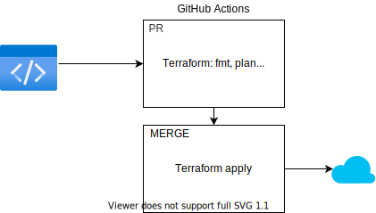

# GitOps with Terraform Cloud and GitHub
This repository keeps track of a couple of Kubernetes cluster environment, running in Azure, which runs a few of applications. What we are trying to achieve here is an automated process so that we can easily add applications, and have them tested and deployed. The idea is to have as much as possible automated, and use only GitHub Actions as orchestration.
## The workflow

When doing a pull request, we want that code to run a couple of tasks on it. We want to make sure the code follows our format principals, and check the code for potential security and/or cost issues. This will be displayed in our pull request, so that we can get a good idea if the new changes are good or not.

If everything works out as planned, we merge to code to our working branch which will kick of another action that run the Terraform apply.

## What makes it work
- [Terraform OSS](https://terraform.io)
- [Checkov](https://www.checkov.io/)